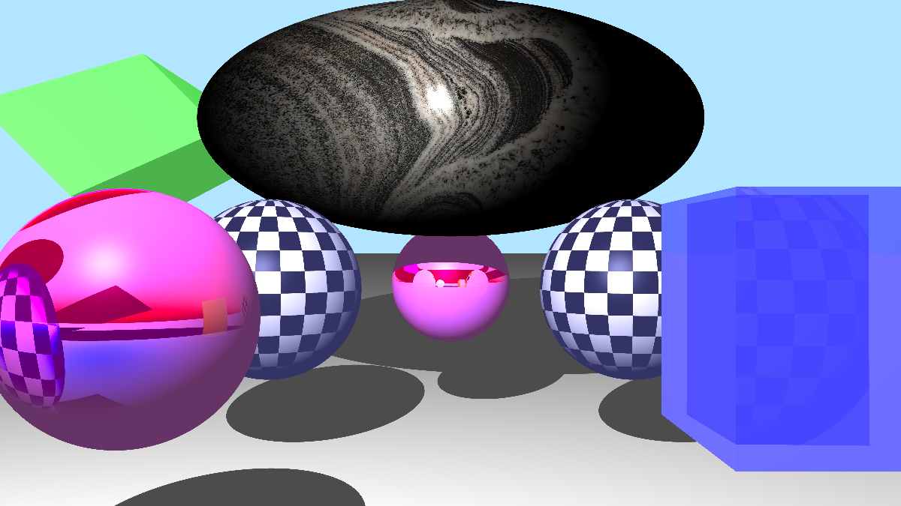

 

# PyRaytracer

A raytracing program built in Python using PyGame in my CSCI-340 class.

### How to run
To Run:

python3 rayTracer.py -f [FileName] -sh [ShowType] -s [Sample per Pixel]

or 

make run

### Flags:
-f -> File Name: Name of file if you save it.

-sh -> Show Type: For Progressive Renderer, the name of the enum of ShowTypes

-s -> Sample Per Pixel: How many samples it will take when anti-aliasing

### To Adjust the Scene:
Go to modules/raytracing/scene

In there, you can change which shapes appear
